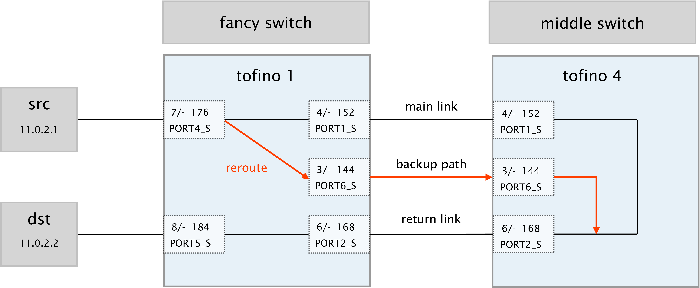

# FANcY Tofino Implementationn

In this page, you will find all the needed code and documentation to run `FANcY`
hardware implementation in `p4_14`. That includes the P4 code itself,
controllers, utility scripts and an orchestrator to help us run the evaluation:

* The `eval` folder contains `tofino-test.py` which is a script that is able to
  run all the different evaluation experiments. For that the script uses TCP
  `sockets` to send commands to different components involved in the eval such
  as receiver and Tofino switches.

* The `scripts` folder contains a set of utilities used by all the other scripts.

* The `p4src` folder contains the code of `fancy` and also some special switch
  code called `middle_switch.p4` which we use as a middle switch between fancy's
  upstream and downstream. This switch is in charge of adding some packet drops
  when instructed. For `fancy`, you will find two main programs `fancy.p4` and
  `fancy_zooming.p4`. At the time of writing and due to a bug with the `SDE` we
  used to develop the code we had to split the two main components into two
  programs. I am currently working on translating to `p4_16` and using the
  latest `SDE` to fix this issue.

* The `control_plane` folder contains the control plane for our three programs.
  For the control plane we use `run_pd_rpc.py` and a custom python server to be
  able to listen to commands sent by the orchestrator.

## Setup requirements

To run our case study, you will need to have a setup with the following requirements:

* Two Barefoot Tofino Switches. We used the Wedge 100BF-32X. 
    * The switches must be running the SDE version 9.2.0. 
    * System-wide python needs to be `python2`. I know this is not ideal, but
      the old SDE uses `python2`. You can change it like this and after revert it. 
      ```
      sudo ln -sf $(which python2) /usr/bin/python
      ```
    * You need to make sure your `run_pd_rpc.py` starts with `#!/usr/bin/python2`
    * You need to install scapy for `python2`: `pip2 install scapy==2.4.3`.
      Usually it gets installed with the SDE.


* You need two servers. One sender and one receiver.
    * Each server should have a 100Gbe NIC. We used Mellanox ConnectX-5 100Gbps NIC.
    * You need to install `iperf-2.1.0`. We use a flag, that is not available
      with the `iperf` version you get from `apt-get`. To install it you can simply:
        ```
        Install iperf version
        wget https://sourceforge.net/projects/iperf2/files/iperf-2.1.0-rc.tar.gz
        tar -xvf iperf-2.1.0-rc.tar.gz
        cd iperf-2.1.0-rc/
        ./configure; make; sudo make install
        # make sure it has updated
        ```
    * You need internet connectivity from the sender to the receiver and the
      Tofino switches. The orchestrator needs that to send commands. Thus, make
      that for that you use open ports.

## Topology and setup

In order to successfully run the evaluation you will need to setup your testbed
as depicted in the figure below:



In the figure, you can see that we are using two servers, one sender and one
receiver. Each is connected two the first switch `tofino1` (name in our
setup) which is running one of the `FANcY` programs.  Note, that we connect them
to port 7 (176) and 8 (184) respectively. Then, `tofino1` is connected to `tofino4` using
3x100G cables:
    * Main link: this is the link `fancy` uses to send traffic to `dst` through `tofino4`. And used by `tofino4` to send traffic to `src` when it comes form `dst`.
    * Return link:  the same but for traffic from and to `dst`.
    * Backup path: this is the link `fancy` uses to send traffic from `src` to `dst` when a failure is detected.

The second switch, `tofino4` is running the program `middle_switch.p4`. This is
a special program that simply forwards packets as described above, and as you can see
in the figure. Furthermore, during `runtime` and through the control plane, it can
be configured such that it drops some `%` for the packets. 

:warning: Note that apart from physical and internal port numbers, each port has
a port name, `PORTX_S`. Those port names are important and are hardcoded in the
[`p4src/includes/constants.p4` file](./p4src/includes/constants.p4#L56). In case
you want to use different tofino ports, you must also update the mappings there
and recompile the program. Control plane code also depends on those constant `#defines`.

## How to run and reproduce paper results

:hourglass_flowing_sand: Once you have all installed, running the experiments is
relatively easy. The expected time to run the following experiments is 20 minutes.

### Preliminary steps

1. Copy the tofino folder in the servers and tofino switches. Alternatively pull the entire repository. In the following example we have copied the content of the tofino folder at `~/fancy/`. 
2. Make sure the right `iperf` is installed in both servers. If not read the requirements section and install `iperf`. 
    ```
    $ iperf -v
    iperf version 2.1.0-rc (5 Jan 2021) pthreads
    ```
3. Make sure `scapy` is installed in the switches for `python2`.
    ```
    $ pip list | grep scapy
    scapy  2.4.3
    ```
4. Configure sender and receiver `IPs` and `ARP` table. For that you can use [`scripts/server_setup.sh`](./scripts/server_setup.sh) utility. Do the same for both sender and receiver, but swap the ips and use the mac address of the other side. 
    ```
    cd ~/fancy/scripts/
    ./server_setup.sh <intf> <src ip> <dst ip> <dst mac>
    ```
5. Make sure you have the `env variables` pointing to `SDE 9.2.0`.
    ```
    $ echo $SDE
    /data/bf-sde-9.2.0
    ```

6. Compile `fancy.p4` and `fancy_zooming.p4` at the first switch (`tofino1`).
    ```
    # first program
    ~/p4_build_new.sh -D SDE9 -D HARDWARE -D REROUTE --with-tofino --no-graphs ~/fancy/p4src/fancy.p4

    # second program
    ~/p4_build_new.sh -D SDE9 -D HARDWARE --with-tofino --no-graphs ~/fancy/p4src/fancy_zooming.p4
    ```

    Note that our `p4_build` script is called `p4_build_new`. And we are using several preprocessor (`-D`) parameters. Also, we assume this placed at `~/fancy`.

7. Compile `middle_switch.p4` at the second switch (`tofino4`)
    ```
    ~/p4_build_new.sh --with-tofino --no-graphs ~/fancy/p4src/middle_switch.p4
    ```

You are all set to start the experiments! :rocket:

### Running the experiments

Now we will run the experiments needed to get the case study `figure 8` from the paper. To make the experiments simple we will use [`eval/tofino-test.py`](./eval/tofino-test.py) which is an orchestrator that will make our life very easy.

In order for the orchestrator to know how to send commands to the other server and tofino switches, you will need to  modify the contents of `eval/server_mappings.py` with the IP (public or private) of your two servers and switches. You can find some default ports, but feel free to change them if needed. 

```
remote_mappings = {
    "tofino1": ("<tofino ip>", 5000),
    "tofino4": ("<tofino ip>", 5001),
    "sender": ("<sender server ip>", 31500),
    "receiver": ("<receiver server ip>", 31500)
}
```

Everything is ready to start the experiments.

#### Dedicated counters experiment

1. Start the command server at the receiver server. 
    ```
    cd ~/fancy/eval
    python2 command_server.py --port 31500
    ```

2. Start the `middle_switch` at `tofino4`. 
    ```
    $SDE/run_switchd.sh -p middle_switch
    ```

3. Start control plane for the `middel_switch` at `tofino4`.
    ```
    cd ~/fancy/control_plane 
    ~/old_tools/run_pd_rpc.py -p middle_switch -i controller_middle_switch.py
    ```

4. Start `fancy` at `tofino1`. 
    ```
    $SDE/run_switchd.sh -p fancy
    ```

5. Start control plane for `fancy` at `tofino1`.
    ```
    cd ~/fancy/control_plane
    ~/old_tools/run_pd_rpc.py -p fancy -i controller_fancy.py
    ```

6. Start the orchestrator at the sender server.
    ```
    cd ~/tofino-fancy/eval
    sudo python2 tofino-test.py --test_type dedicated --output_dir ~/dedicated_outputs/ --remote_server receiver
    ```

7. Wait 3 minutes, all the results will be stored at `~/dedicated_outputs/`


#### Zooming experiments

1. You can keep the receiver server and `middle_switch` part untouched.

4. Start `fancy_zooming` at `tofino1`. 
    ```
    $SDE/run_switchd.sh -p fancy_zooming
    ```

5. Start control plane for `fancy_zooming` at `tofino1`.
    ```
    cd ~/fancy/control_plane 
    ~/old_tools/run_pd_rpc.py -p fancy_zooming -i controller_fancy_zooming.py
    ```

6. Start the orchestrator at the sender server.
    ```
    cd ~/fancy/eval/
    sudo python2 tofino-test.py --test_type zooming --output_dir ~/zooming_outputs/ --remote_server receiver --sender_intf enp129s0f0
    ```

7. Wait 3 minutes, all the results will be stored at `~/zooming_outputs/`


#### Plotting

You will find instructions of how to plot the [SIGCOMM eval page](../eval_sigcomm2022/README.md#running-tofino-case-study/).